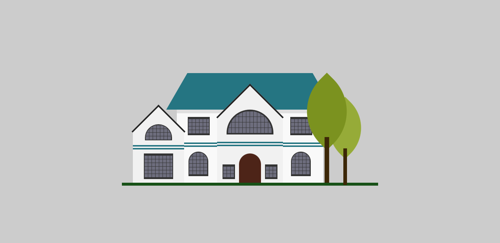

<h1 align="center"> House in HTML/CSS 💻 </h1>

## Briefing 📄

Desenho de uma casa utilizando html e css.

O link para o tutorial com mais detalhes: [Youtube](https://youtu.be/vSHeUBstWxc)

<h2 align="left"> Objetivos 📌 </h2>

- Melhorar skills como front-end developer

---

<h3 align="center"> showcase 📝 </h3>

<h3 align="center"> Tecnologias utilizadas 🤖 </h3>

> 

